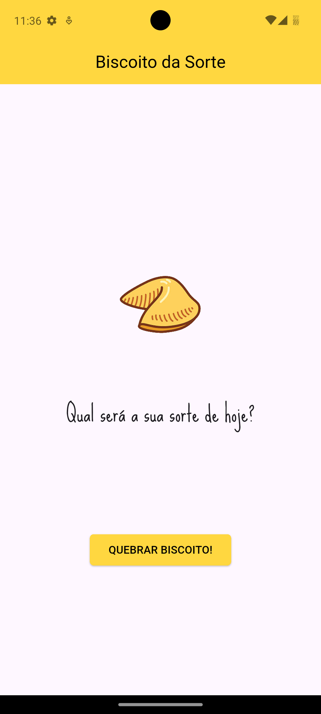

 
# 🍪 Biscoito da Sorte

Aplicativo desenvolvido durante o **Curso de Flutter da Danki Code**, ministrado pelo professor **Caio Malheiros**.

O app mostra mensagens de "biscoito da sorte" ao usuário, trazendo frases voltadas ao mundo de desenvolvimento e design de apps de forma divertida.
 
## 🚀 Tecnologias

* **Flutter** (Dart)
* **Material Design**
* Compatível **apenas com Android**

## 📱 Funcionalidades

* Exibe mensagens aleatórias de biscoito da sorte do mundo dev/designer de apps
* Interface simples e leve
* Design baseado no **Material Design** 

## 🖼️ Screenshots


 
## 📦 Como rodar o projeto

1. Clone este repositório:

   ```bash
   git clone https://github.com/Ahosall/fortune-cookie.git
   ```
2. Acesse a pasta do projeto:

   ```bash
   cd fortune-cookie
   ```
3. Instale as dependências:

   ```bash
   flutter pub get
   ```
4. Rode no emulador ou dispositivo Android conectado:

   ```bash
   flutter run
   ```

## 📥 APK

Se você quiser apenas instalar e testar o app sem compilar, pode baixar o **APK pronto** disponível na seção de [Releases](https://github.com/Ahosall/fortune-cookie/releases) deste repositório.
 
## 🎓 Créditos

- Projeto desenvolvido durante o [**curso de Flutter completo da Danki Code**](https://cursos.dankicode.com/curso-flutter-completo)
- Professor: **Caio Malheiros**
 

